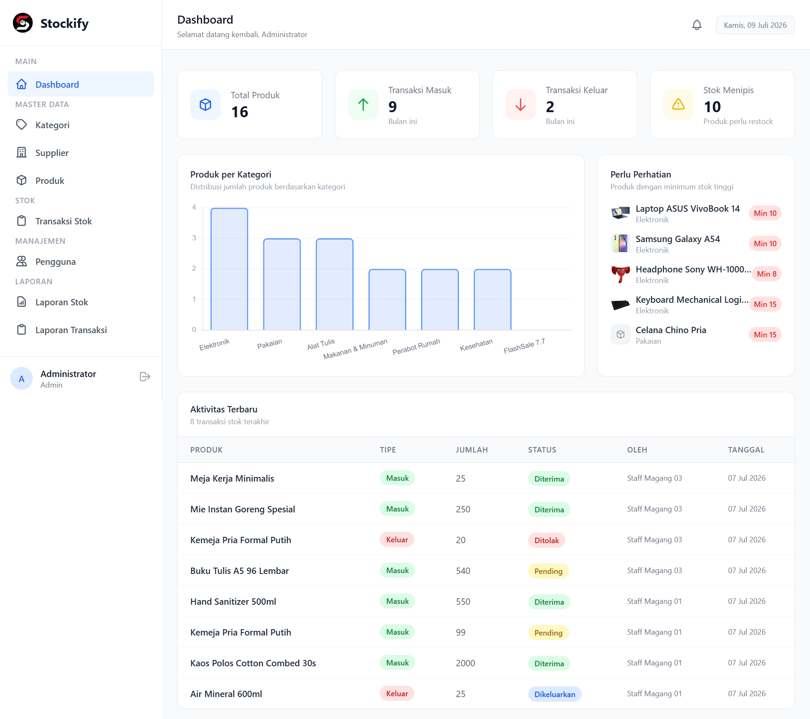
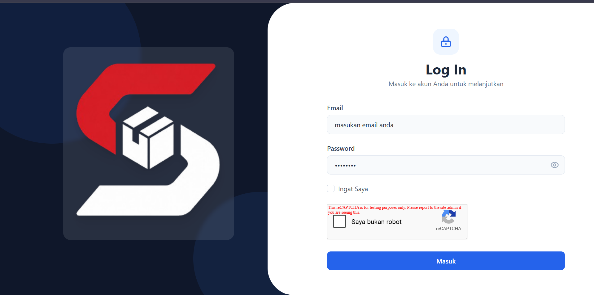

<div align="center">
# 📦 Stockify
 
**Sistem Manajemen Stok Gudang berbasis Web**
 


 
</div>
---
 
## 🧾 Tentang Project
 
**Stockify** adalah aplikasi web manajemen stok gudang yang dikembangkan untuk menggantikan pencatatan manual yang rentan terhadap kesalahan manusia, tidak efisien, dan sulit diaudit.
 

 
---
 
## ✨ Fitur Utama
 
- 🔐 **Autentikasi & Otorisasi**
- 📊 **Dashboard per Role**
- 🗂️ **Manajemen Data Master**
- 🔄 **Alur Transaksi Multi-Role**
- 📦 **Kalkulasi Stok Dinamis**
- 🧮 **Validasi Stok Real-time**
- 🕓 **Riwayat Transaksi**
- 📄 **Laporan & Ekspor PDF**
---
 
## 👥 Role Pengguna & Hak Akses
 
| Role | Deskripsi | Level Akses |
|---|---|---|
| **Admin** | Pengelola sistem secara keseluruhan, bertanggung jawab atas data master dan konfigurasi pengguna. | Penuh (*Full Access*) |
| **Manajer Gudang** | Mengawasi operasional gudang, mengonfirmasi/menolak transaksi stok, memantau kondisi stok. | Operasional + Read-only Master Data |
| **Staff Gudang** | Pelaksana harian yang menginput transaksi barang masuk/keluar dan memantau pengajuan miliknya. | Input Transaksi |
 
---
 
## 🧰 Teknologi & Arsitektur
 
| Layer | Teknologi | Versi |
|---|---|---|
| Backend Framework | Laravel | 10.x |
| Bahasa Pemrograman | PHP | 8.2+ |
| Database | MySQL | 8.x |
| Frontend Styling | Tailwind CSS | 3.4.17 |
| UI Components | Flowbite | Latest |
| Build Tool | Vite | Latest |
| PDF Export | DomPDF (barryvdh) | Latest |
| Design Tool | MySQL Workbench | Latest |
| Version Control | Git + GitHub | — |
 
> Stockify menerapkan pola arsitektur **Controller-Service-Repository** yang memisahkan tanggung jawab tiap layer secara tegas.
 
---
 
## 📁 Struktur Proyek
 
```
stockify/
├── app/
│   ├── Http/
│   │   └── Controllers/
│   │       ├── Admin/
│   │       ├── Manager/
│   │       └── Staff/
│   ├── Services/
│   ├── Repositories/
│   │   ├── Interfaces/
│   │   └── Eloquent/
│   ├── Models/
│   └── Http/Middleware/
├── resources/
│   └── views/
│       ├── admin/
│       ├── manager/
│       ├── staff/
│       └── layouts/
├── routes/
│   └── web.php
├── database/
│   └── (skema dikelola via MySQL Workbench)
├── public/
└── .env.example
```
 
---
 
## 💻 Kebutuhan Sistem
 
### Software yang Dibutuhkan
 
- PHP **8.2** atau lebih tinggi
- Composer
- Node.js & NPM (untuk build asset via Vite)
- MySQL **8.x**
- MySQL Workbench (untuk mengelola skema database)
- Git
---
 
## ⚙️ Instalasi & Konfigurasi
 
> ⚠️ Karena Stockify menggunakan pendekatan **database-first**, pastikan skema database sudah tersedia. Dapatkan database dengan meminta izin ke **Pengembang**.
 
### 1. Clone Repository
 
```bash
git clone https://github.com/Jakwanaja/stockify-project
cd stockify-project
```
 
### 2. Install Dependency
 
```bash
composer install
npm install
```
 
### 3. Konfigurasi Environment
 
```bash
cp .env.example .env
php artisan key:generate
```
 
Sesuaikan konfigurasi database pada file `.env`:
 
```env
DB_CONNECTION=mysql
DB_HOST=127.0.0.1
DB_PORT=3306
DB_DATABASE=stockify_db
DB_USERNAME=root
DB_PASSWORD=
```
 
### 4. Siapkan Database
 
Import skema database (hasil desain MySQL Workbench) ke MySQL
 
### 5. Seed Data Awal (opsional)
 
```bash
php artisan db:seed --class=UserSeeder
```
 
### 6. Build Asset Frontend
 
```bash
npm run build
```
 
### 7. Jalankan Server
 
```bash
php artisan serve
```
 
Aplikasi dapat diakses melalui `http://127.0.0.1:8000`.
 

 
---

## 👤 Kontributor
 
Dikembangkan oleh **Muhamad Dzakwan Alfaris**
Program Studi Teknologi Rekayasa Perangkat Lunak, Politeknik Negeri Madiun (2026)